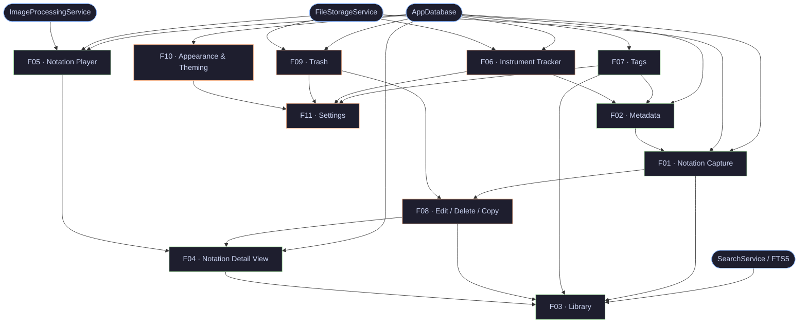

# Feature DAG — Swaralipi

## Table of Contents

- [1. Overview](#1-overview)
- [2. Graph](#2-graph)
- [3. Nodes](#3-nodes)
  - [3.1 Infrastructure Services](#31-infrastructure-services)
  - [3.2 Features](#32-features)
- [4. Dependency Table](#4-dependency-table)
- [5. Critical Path](#5-critical-path)
- [6. Complexity & Risk](#6-complexity--risk)

---

## 1. Overview

Directed acyclic graph of all V1 features and infrastructure services.
Edge `A → B` means **A must exist before B can be built**.

Sources: [PRD](../01-product/PRD.md) · [SDS](./sds.md) · [Data Model](./data-model.md) · [Storage](./storage.md) · [Navigation](./navigation-structure.md)

---

## 2. Graph



---

## 3. Nodes

### 3.1 Infrastructure Services

| ID   | Name | Description |
|------|------|-------------|
| SVC1 | AppDatabase | SQLite via Drift; owns all entity schemas and migrations. [SDS §Architecture](./sds.md) · [Storage §Database](./storage.md) |
| SVC2 | FileStorageService | Saves and deletes JPEG images under `appDocDir/`; manages path consistency. [Storage §File Layout](./storage.md) |
| SVC3 | ImageProcessingService | Applies non-destructive RenderParams (filter, crop, rotate) at display time. [Storage §Non-Destructive Pipeline](./storage.md) · [SDS](./sds.md) |
| SVC4 | SearchService | FTS5 virtual table queries over title, artists, notes. [SDS §Core Services](./sds.md) |

### 3.2 Features

| ID   | Name | Description |
|------|------|-------------|
| F01  | Notation Capture | Gallery/camera ingestion, per-page editor, filter/crop/rotate, metadata form. [PRD §5.1](../01-product/PRD.md#51-notation-capture) |
| F02  | Metadata | 13-field schema (title, artists, timing, language, tags, instruments, custom fields). [PRD §5.2](../01-product/PRD.md#52-metadata) · [Data Model](./data-model.md) |
| F03  | Library | Home screen — recently played carousel, notation list, fuzzy search, sort, tag filter. [PRD §5.3](../01-product/PRD.md#53-library-home-screen) · [Navigation](./navigation-structure.md) |
| F04  | Notation Detail View | Single-notation read view with metadata block, play entry, edit/delete actions. [PRD §5.4](../01-product/PRD.md#54-notation-detail-view) · [Navigation](./navigation-structure.md) |
| F05  | Notation Player | Full-screen viewer; swipe pages, pinch-zoom, orientation lock, fade chrome. [PRD §5.5](../01-product/PRD.md#55-notation-player) |
| F06  | Instrument Tracker | Two-level CRUD (InstrumentClass + InstrumentInstance) with photo and soft-delete archive. [PRD §5.6](../01-product/PRD.md#56-instrument-tracker) · [Data Model](./data-model.md) |
| F07  | Tags | Create/rename/recolor/delete tags; Catppuccin palette; 5 pre-seeded defaults. [PRD §5.7](../01-product/PRD.md#57-tags) · [Data Model](./data-model.md) |
| F08  | Edit / Delete / Copy | CRUD entry points from Library and Detail View; duplicate copies files; delete soft-deletes. [PRD §5.8](../01-product/PRD.md#58-edit-delete-copy) |
| F09  | Trash | Soft-deleted notation list; restore or purge; auto-purge after 30 days. [PRD §5.9](../01-product/PRD.md#59-trash) · [Data Model](./data-model.md) |
| F10  | Appearance & Theming | Light/Dark/System toggle; Dynamic Monet or Catppuccin seed color. [PRD §5.10](../01-product/PRD.md#510-appearance--theming) |
| F11  | Settings | Top-level shell aggregating Tags, Instruments, Trash, Appearance, Custom Fields, and app info. [PRD §5.11](../01-product/PRD.md#511-settings) · [Navigation](./navigation-structure.md) |
| F12  | Custom Fields | CRUD for user-defined custom field definitions (name + type); fields appear in the metadata form. [PRD §5.2](../01-product/PRD.md#52-metadata) · [Data Model §2.8](./data-model.md) · [State Management §5.10](./state-management.md) |

---

## 4. Dependency Table

| ID   | Depends On | Why |
|------|------------|-----|
| SVC1 | —          | foundation |
| SVC2 | —          | foundation |
| SVC3 | —          | foundation |
| SVC4 | SVC1       | FTS5 is a virtual table inside AppDatabase |
| F07  | SVC1       | tags persisted in DB |
| F06  | SVC1, SVC2 | instances persisted in DB; photo on disk |
| F10  | SVC1       | UserPreferences written to DB |
| F09  | SVC1, SVC2 | soft-delete flag in DB; files retained until purge |
| F12  | SVC1       | custom field definitions persisted in DB |
| F02  | SVC1, F07, F06, F12 | metadata form embeds tag, instrument, and custom field pickers |
| F01  | SVC1, SVC2, F02 | capture saves pages to disk, metadata to DB |
| F08  | F01, F09   | edit re-enters capture flow; delete lands in trash |
| F03  | SVC4, F01, F07, F08, F04 | list needs saved notations, tag filter, search, and navigation target |
| F04  | SVC1, F08, F05 | reads notation from DB; hosts edit/delete; launches player |
| F05  | SVC1, SVC2, SVC3 | fetches pages from DB + disk; renders with image pipeline |
| F11  | F07, F06, F09, F10, F12 | settings shell aggregates all sub-sections |

---

## 5. Critical Path

Longest dependency chain (trunk — nothing can be parallelised away from this):

```
SVC1 → SVC2 → F07 → F02 → F01 → F08 → F04 → F03
                                  ↑
                                 F09
```

Build order for trunk:

1. SVC1 (AppDatabase + schema)
2. SVC2 (FileStorageService)
3. F07 (Tags — needed by metadata)
4. F02 (Metadata — needed by capture)
5. F01 (Notation Capture — populates library)
6. F09 (Trash — needed by delete)
7. F08 (Edit / Delete / Copy — needed by detail view)
8. F04 (Notation Detail View — navigation target from library)
9. F03 (Library — final home screen)

Branch work (parallel once blocker is done):

| Branch | Unblocked after |
|--------|-----------------|
| SVC3 (ImageProcessingService) | — (day 1) |
| SVC4 (SearchService) | SVC1 |
| F06 (Instrument Tracker) | SVC1, SVC2 |
| F10 (Appearance & Theming) | SVC1 |
| F12 (Custom Fields) | SVC1 |
| F05 (Notation Player) | SVC1, SVC2, SVC3 |
| F11 (Settings) | F07, F06, F09, F10, F12 |

---

## 6. Complexity & Risk

| ID   | Complexity | Risk   | Driver |
|------|-----------|--------|--------|
| SVC1 | L         | High   | Schema correctness; migration safety; FTS5 setup |
| SVC2 | M         | Medium | Orphan file cleanup; path portability |
| SVC3 | L         | High   | Non-destructive pipeline; filter quality on-device |
| SVC4 | M         | Medium | FTS5 ranking; tokeniser config |
| F01  | XL        | High   | Camera intent + gallery picker + page editor + pipeline integration |
| F02  | M         | Low    | Form with fixed schema; no async surprises |
| F03  | L         | Medium | FTS search UX + filter presets + sort + recently played carousel |
| F04  | S         | Low    | Read-only display; thin ViewModel |
| F05  | L         | Medium | Pinch-zoom; orientation lock; RenderParams rendering |
| F06  | M         | Low    | Standard CRUD + soft-delete + photo capture |
| F07  | S         | Low    | Simple CRUD + Catppuccin colour picker |
| F08  | M         | Medium | Multi-entry-point; file duplication on copy |
| F09  | S         | Low    | Soft-delete list + scheduled auto-purge |
| F10  | S         | Low    | Preference write + theme rebuild; no data flow |
| F11  | M         | Low    | Shell only; no new logic |
| F12  | S         | Low    | Simple CRUD; no async surprises; no file I/O |
