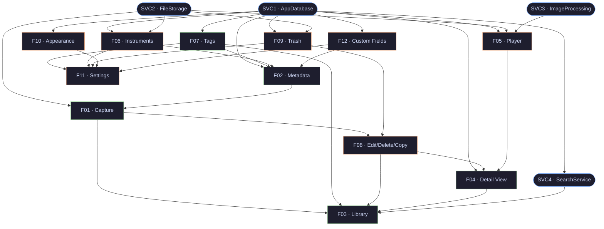

# Swaralipi — Implementation Roadmap

## Table of Contents

- [1. Executive Summary](#1-executive-summary)
- [2. Dependency Graph Summary](#2-dependency-graph-summary)
- [3. Epic Breakdown](#3-epic-breakdown)
- [4. Feature Breakdown](#4-feature-breakdown)
- [5. Sprint Plan](#5-sprint-plan)
  - [Sprint 1 — Database Foundation](#sprint-1--database-foundation)
  - [Sprint 2 — File Storage & Search](#sprint-2--file-storage--search)
  - [Sprint 3 — Image Pipeline & Quick Wins](#sprint-3--image-pipeline--quick-wins)
  - [Sprint 4 — Tags, Trash & Instruments](#sprint-4--tags-trash--instruments)
  - [Sprint 5 — Metadata Form](#sprint-5--metadata-form)
  - [Sprint 6 — Notation Capture Part 1](#sprint-6--notation-capture-part-1)
  - [Sprint 7 — Notation Capture Part 2](#sprint-7--notation-capture-part-2)
  - [Sprint 8 — Edit / Delete / Copy & Player Start](#sprint-8--edit--delete--copy--player-start)
  - [Sprint 9 — Player Completion & Detail View](#sprint-9--player-completion--detail-view)
  - [Sprint 10 — Library & Settings Shell](#sprint-10--library--settings-shell)
  - [Backlog (unscheduled)](#backlog-unscheduled)
- [6. Open Questions](#6-open-questions)
- [7. Risks](#7-risks)

---

## 1. Executive Summary

- **7 epics** (6 product + 1 documentation), **16 features** (4 infrastructure services + 12 user-facing), **~34 stories**, **~124 tasks**
- **10 planned sprints** (2 weeks each, ~20 weeks total), single developer
- **Critical path**: SVC1 → SVC2 → F07 → F02 → F01 → F09 → F08 → F04 → F03 — cannot be parallelised away
- **Highest risk**: F01 (Notation Capture, XL/High) spans 2 sprints; SVC1 and SVC3 are each L/High and gate everything downstream
- **First shippable slice** (all core flows functional): end of Sprint 9 (~2026-08-31)

---

## 2. Dependency Graph Summary

---

## 3. Epic Breakdown

### 3.1. [Epic #7] Infrastructure Foundation

- **Priority**: P0
- **Complexity**: L (SVC1, SVC3 each L/High; SVC2, SVC4 each M/Medium)
- **Features**: SVC1, SVC2, SVC3, SVC4
- **Critical path**: Yes — SVC1 blocks all feature work; SVC2/SVC3 block capture and player

### 3.2. [Epic #8] Notation Capture & Metadata

- **Priority**: P0
- **Complexity**: XL (F01 alone is XL/High)
- **Features**: F07, F12, F02, F01
- **Critical path**: Yes — F07 → F02 → F01 is the longest trunk chain

### 3.3. [Epic #9] Notation Management

- **Priority**: P0
- **Complexity**: M (F09 S/Low, F08 M/Medium)
- **Features**: F09, F08
- **Critical path**: Partially — F09 is required before F08; F08 gates F04 and F03

### 3.4. [Epic #10] Notation Viewing & Playback

- **Priority**: P1
- **Complexity**: L (F05 L/Medium, F04 S/Low)
- **Features**: F05, F04
- **Critical path**: Yes — F04 gates F03 (Library)

### 3.5. [Epic #11] Library & Search

- **Priority**: P0
- **Complexity**: L (F03 L/Medium)
- **Features**: F03
- **Critical path**: Yes — final trunk node; requires all preceding trunk complete

### 3.6. [Epic #12] User Experience & Settings

- **Priority**: P1
- **Complexity**: M (F06 M/Low, F10 S/Low, F11 M/Low, F12 S/Low)
- **Features**: F06, F10, F12, F11
- **Critical path**: No — all branch work; F12 must finish before F02

### 3.7. [Epic #1] Documentation

- **Priority**: P1
- **Complexity**: S
- **Features**: README, contributing guides, API docs
- **Critical path**: No

---

## 4. Feature Breakdown

### 4.1. [Feature] SVC1 — AppDatabase

- **Parent epic**: #7 Infrastructure Foundation
- **Depends on**: —
- **Trunk/Branch**: Trunk
- **Complexity**: L / Risk: High
- **Stories**:
  1. Define all Drift table classes and relationships
  2. Implement DAOs (NotationDao, TagDao, InstrumentDao, CustomFieldDao, UserPreferencesDao)
  3. Set up FTS5 virtual table and full migration pipeline

### 4.2. [Feature] SVC2 — FileStorageService

- **Parent epic**: #7 Infrastructure Foundation
- **Depends on**: —
- **Trunk/Branch**: Trunk
- **Complexity**: M / Risk: Medium
- **Stories**:
  1. Implement save/retrieve/delete JPEG under `appDocDir/`
  2. Implement orphan cleanup and path-portability guarantees

### 4.3. [Feature] SVC3 — ImageProcessingService

- **Parent epic**: #7 Infrastructure Foundation
- **Depends on**: —
- **Trunk/Branch**: Branch (day-1 parallel)
- **Complexity**: L / Risk: High
- **Stories**:
  1. Define RenderParams model (filter, crop, rotate)
  2. Implement non-destructive filter rendering (ColorFiltered widget + image package)
  3. Implement crop and rotate transforms; verify originals are never written

### 4.4. [Feature] SVC4 — SearchService

- **Parent epic**: #7 Infrastructure Foundation
- **Depends on**: SVC1
- **Trunk/Branch**: Branch
- **Complexity**: M / Risk: Medium
- **Stories**:
  1. Implement FTS5 ranked query over title, artists, notes
  2. Implement result ranking, pagination, and tokeniser config

### 4.5. [Feature] F07 — Tags

- **Parent epic**: #8 Notation Capture & Metadata
- **Depends on**: SVC1
- **Trunk/Branch**: Trunk
- **Complexity**: S / Risk: Low
- **Stories**:
  1. Tag CRUD (create, rename, recolor, delete) with Catppuccin palette and 5 pre-seeded defaults

### 4.6. [Feature] F12 — Custom Fields

- **Parent epic**: #12 User Experience & Settings
- **Depends on**: SVC1
- **Trunk/Branch**: Branch
- **Complexity**: S / Risk: Low
- **Stories**:
  1. Custom field definition CRUD (name + type); fields surfaced in metadata form

### 4.7. [Feature] F10 — Appearance & Theming

- **Parent epic**: #12 User Experience & Settings
- **Depends on**: SVC1
- **Trunk/Branch**: Branch
- **Complexity**: S / Risk: Low
- **Stories**:
  1. Light/Dark/System toggle and Catppuccin/Monet seed-color picker; persist to UserPreferences

### 4.8. [Feature] F09 — Trash

- **Parent epic**: #9 Notation Management
- **Depends on**: SVC1, SVC2
- **Trunk/Branch**: Branch
- **Complexity**: S / Risk: Low
- **Stories**:
  1. Trash screen — list soft-deleted notations, restore, purge, auto-purge after 30 days

### 4.9. [Feature] F06 — Instrument Tracker

- **Parent epic**: #12 User Experience & Settings
- **Depends on**: SVC1, SVC2
- **Trunk/Branch**: Branch
- **Complexity**: M / Risk: Low
- **Stories**:
  1. InstrumentClass CRUD (create, edit, archive)
  2. InstrumentInstance CRUD with in-app photo capture/import and soft-delete archive

### 4.10. [Feature] F02 — Metadata

- **Parent epic**: #8 Notation Capture & Metadata
- **Depends on**: SVC1, F07, F06, F12
- **Trunk/Branch**: Trunk
- **Complexity**: M / Risk: Low
- **Stories**:
  1. Metadata form UI — 13 fields, tag/instrument/custom-field pickers, validation
  2. MetadataRepository — save, update, load notation metadata

### 4.11. [Feature] F01 — Notation Capture

- **Parent epic**: #8 Notation Capture & Metadata
- **Depends on**: SVC1, SVC2, F02
- **Trunk/Branch**: Trunk
- **Complexity**: XL / Risk: High
- **Stories**:
  1. Camera permission handling and CameraX integration
  2. Gallery import flow (multi-page picker)
  3. Per-page editor UI (filter/crop/rotate controls)
  4. Non-destructive RenderParams pipeline integration per page
  5. End-to-end save flow (pages → disk, metadata → DB)

### 4.12. [Feature] F08 — Edit / Delete / Copy

- **Parent epic**: #9 Notation Management
- **Depends on**: F01, F09
- **Trunk/Branch**: Branch
- **Complexity**: M / Risk: Medium
- **Stories**:
  1. Edit notation — re-enter metadata form and page editor from Library/Detail View
  2. Duplicate notation — copy all image files; create new DB record
  3. Soft-delete — move to Trash from Library and Detail View entry points

### 4.13. [Feature] F05 — Notation Player

- **Parent epic**: #10 Notation Viewing & Playback
- **Depends on**: SVC1, SVC2, SVC3
- **Trunk/Branch**: Branch
- **Complexity**: L / Risk: Medium
- **Stories**:
  1. Full-screen viewer — swipe-between-pages, pinch-zoom
  2. Orientation lock (portrait / landscape) and chrome fade on inactivity
  3. Auto-scroll at configurable speed; persist speed preference

### 4.14. [Feature] F04 — Notation Detail View

- **Parent epic**: #10 Notation Viewing & Playback
- **Depends on**: SVC1, F08, F05
- **Trunk/Branch**: Trunk
- **Complexity**: S / Risk: Low
- **Stories**:
  1. Read-only detail screen — metadata block, page thumbnails, Play / Edit / Delete actions

### 4.15. [Feature] F03 — Library

- **Parent epic**: #11 Library & Search
- **Depends on**: SVC4, F01, F07, F08, F04
- **Trunk/Branch**: Trunk
- **Complexity**: L / Risk: Medium
- **Stories**:
  1. Recently-played carousel (last 5 opened)
  2. Notation list with `ListView.builder`, sort (date, title, artist)
  3. Fuzzy search bar and tag filter panel

### 4.16. [Feature] F11 — Settings

- **Parent epic**: #12 User Experience & Settings
- **Depends on**: F07, F06, F09, F10, F12
- **Trunk/Branch**: Branch
- **Complexity**: M / Risk: Low
- **Stories**:
  1. Settings shell screen — navigation to Tags, Instruments, Trash, Appearance, Custom Fields, app info
  2. Integrate all sub-sections into shell; verify navigation and state preservation

---

## 5. Sprint Plan

> Capacity: single developer, ~3–4 tasks per sprint, 2-week iterations.
> Trunk items are sequenced serially; branch items are layered alongside trunk where capacity allows.

### Sprint 1 — Database Foundation

**Goal**: Stable, tested AppDatabase with all entity schemas, migrations, and FTS5.

**Start**: 2026-04-28  **End**: 2026-05-11

| Issue | Title | Type | Size | Priority | Depends On |
|-------|-------|------|------|----------|------------|
| TBD | Define all Drift table classes (notations, pages, tags, instruments, custom_fields, prefs) | task | L | P0 | — |
| TBD | Implement DAOs — NotationDao, TagDao, InstrumentDao, CustomFieldDao, UserPreferencesDao | task | L | P0 | above |
| TBD | Set up FTS5 virtual table + migration test harness | task | M | P0 | above |
| TBD | Unit-test all DAOs with in-memory Drift DB (≥80% coverage) | task | M | P0 | above |

**Definition of Done for Sprint**:

- [ ] All sprint issues closed or moved to backlog with documented reason
- [ ] CI green on main
- [ ] Regression test suite passes

---

### Sprint 2 — File Storage & Search

**Goal**: FileStorageService and SearchService operational; SVC3 started in parallel.

**Start**: 2026-05-12  **End**: 2026-05-25

| Issue | Title | Type | Size | Priority | Depends On |
|-------|-------|------|------|----------|------------|
| TBD | Implement FileStorageService — save/retrieve/delete JPEG under appDocDir | task | M | P0 | SVC1 done |
| TBD | Implement orphan-file cleanup and path-portability guarantees | task | S | P0 | above |
| TBD | Implement SearchService — FTS5 ranked query, tokeniser config | task | M | P0 | SVC1 done |
| TBD | Define RenderParams model; scaffold ImageProcessingService (SVC3 start) | task | M | P0 | — |

**Definition of Done for Sprint**:

- [ ] All sprint issues closed or moved to backlog with documented reason
- [ ] CI green on main
- [ ] Regression test suite passes

---

### Sprint 3 — Image Pipeline & Quick Wins

**Goal**: Non-destructive image pipeline complete; F12 and F10 branch features delivered.

**Start**: 2026-05-26  **End**: 2026-06-08

| Issue | Title | Type | Size | Priority | Depends On |
|-------|-------|------|------|----------|------------|
| TBD | Implement filter rendering (ColorFiltered widget + image package) | task | M | P0 | SVC3 scaffolded |
| TBD | Implement crop and rotate transforms; verify originals unmodified | task | M | P0 | above |
| TBD | Custom Field definition CRUD (F12) — ViewModel + Repository + UI | task | S | P1 | SVC1 done |
| TBD | Appearance toggle + Catppuccin/Monet color picker; persist to UserPreferences (F10) | task | S | P1 | SVC1 done |

**Definition of Done for Sprint**:

- [ ] All sprint issues closed or moved to backlog with documented reason
- [ ] CI green on main
- [ ] Regression test suite passes

---

### Sprint 4 — Tags, Trash & Instruments

**Goal**: F07, F09, and F06 delivered; all three are prerequisites for the Metadata form.

**Start**: 2026-06-09  **End**: 2026-06-22

| Issue | Title | Type | Size | Priority | Depends On |
|-------|-------|------|------|----------|------------|
| TBD | Tag CRUD — TagRepository + TagViewModel + Tag list UI with Catppuccin picker (F07) | task | S | P0 | SVC1 done |
| TBD | Trash — soft-delete list, restore, purge, auto-purge job (F09) | task | S | P0 | SVC1, SVC2 done |
| TBD | InstrumentClass CRUD — ViewModel + Repository + list UI (F06 part 1) | task | M | P1 | SVC1, SVC2 done |
| TBD | InstrumentInstance CRUD + photo capture/import + archive (F06 part 2) | task | M | P1 | above |

**Definition of Done for Sprint**:

- [ ] All sprint issues closed or moved to backlog with documented reason
- [ ] CI green on main
- [ ] Regression test suite passes

---

### Sprint 5 — Metadata Form

**Goal**: Complete 13-field metadata form with all pickers; ready to receive capture data.

**Start**: 2026-06-23  **End**: 2026-07-06

| Issue | Title | Type | Size | Priority | Depends On |
|-------|-------|------|------|----------|------------|
| TBD | MetadataRepository — save and update notation record with all 13 fields | task | M | P0 | SVC1, F07, F06, F12 done |
| TBD | Metadata form UI — fields, tag/instrument/custom-field pickers | task | M | P0 | above |
| TBD | Form validation gate — required fields, error states | task | S | P0 | above |
| TBD | MetadataViewModel + widget tests for form states | task | S | P0 | above |

**Definition of Done for Sprint**:

- [ ] All sprint issues closed or moved to backlog with documented reason
- [ ] CI green on main
- [ ] Regression test suite passes

---

### Sprint 6 — Notation Capture Part 1

**Goal**: Camera and gallery ingestion working; per-page editor functional.

**Start**: 2026-07-07  **End**: 2026-07-20

| Issue | Title | Type | Size | Priority | Depends On |
|-------|-------|------|------|----------|------------|
| TBD | Camera permission flow + CameraX integration (capture one page) | task | L | P0 | SVC1, SVC2, F02 done |
| TBD | Gallery import — multi-page picker, page ordering UI | task | L | P0 | SVC2 done |
| TBD | Per-page editor UI — filter/crop/rotate controls layout | task | M | P0 | SVC3 done |

**Definition of Done for Sprint**:

- [ ] All sprint issues closed or moved to backlog with documented reason
- [ ] CI green on main
- [ ] Regression test suite passes

---

### Sprint 7 — Notation Capture Part 2

**Goal**: F01 complete — end-to-end save path from pages to disk and metadata to DB.

**Start**: 2026-07-21  **End**: 2026-08-03

| Issue | Title | Type | Size | Priority | Depends On |
|-------|-------|------|------|----------|------------|
| TBD | Wire RenderParams pipeline per page in the editor | task | M | P0 | Sprint 6 done |
| TBD | End-to-end save flow — pages written to disk, metadata to DB, navigation back to Library | task | L | P0 | above |
| TBD | CaptureViewModel + integration test for full capture flow | task | M | P0 | above |
| TBD | Error handling — camera permission denied, disk full, lifecycle interruption | task | M | P0 | above |

**Definition of Done for Sprint**:

- [ ] All sprint issues closed or moved to backlog with documented reason
- [ ] CI green on main
- [ ] Regression test suite passes

---

### Sprint 8 — Edit / Delete / Copy & Player Start

**Goal**: F08 (CRUD entry points) complete; F05 Player scaffolded and core rendering working.

**Start**: 2026-08-04  **End**: 2026-08-17

| Issue | Title | Type | Size | Priority | Depends On |
|-------|-------|------|------|----------|------------|
| TBD | Edit notation — re-enter metadata form + page editor from Library/Detail (F08) | task | M | P0 | F01, F09 done |
| TBD | Duplicate notation — copy image files + new DB record (F08) | task | M | P0 | F01 done |
| TBD | Soft-delete from Library and Detail View entry points (F08) | task | S | P0 | F09 done |
| TBD | Full-screen player — page list load + swipe navigation + pinch-zoom (F05 start) | task | L | P1 | SVC1, SVC2, SVC3 done |

**Definition of Done for Sprint**:

- [ ] All sprint issues closed or moved to backlog with documented reason
- [ ] CI green on main
- [ ] Regression test suite passes

---

### Sprint 9 — Player Completion & Detail View

**Goal**: F05 and F04 fully shipped; all trunk prerequisites for Library now met.

**Start**: 2026-08-18  **End**: 2026-08-31

| Issue | Title | Type | Size | Priority | Depends On |
|-------|-------|------|------|----------|------------|
| TBD | Orientation lock + chrome fade on inactivity (F05) | task | M | P1 | F05 part 1 done |
| TBD | Auto-scroll at configurable speed; persist preference (F05) | task | M | P1 | above |
| TBD | Notation Detail View — metadata block, page thumbnails, Play/Edit/Delete actions (F04) | task | S | P1 | F08, F05 done |
| TBD | Settings shell — navigation to all sub-sections (F11) | task | M | P1 | F07, F06, F09, F10, F12 done |

**Definition of Done for Sprint**:

- [ ] All sprint issues closed or moved to backlog with documented reason
- [ ] CI green on main
- [ ] Regression test suite passes

---

### Sprint 10 — Library & Settings Shell

**Goal**: Library home screen shipped; app is end-to-end functional. V1 complete.

**Start**: 2026-09-01  **End**: 2026-09-14

| Issue | Title | Type | Size | Priority | Depends On |
|-------|-------|------|------|----------|------------|
| TBD | Recently-played carousel (last 5 opened) (F03) | task | M | P0 | F04 done |
| TBD | Notation list with sort (date, title, artist) and `ListView.builder` (F03) | task | M | P0 | F01 done |
| TBD | Fuzzy search bar + tag filter panel (F03) | task | L | P0 | SVC4, F07 done |
| TBD | F11 Settings — integrate remaining sub-sections; verify navigation and state | task | M | P1 | F11 shell done |

**Definition of Done for Sprint**:

- [ ] All sprint issues closed or moved to backlog with documented reason
- [ ] CI green on main
- [ ] Regression test suite passes

---

### Backlog (unscheduled)

| Issue | Title | Type | Size | Priority | Reason Deferred |
|-------|-------|------|------|----------|-----------------|
| TBD | README + contributing guide (Epic #1 Documentation) | task | S | P1 | Non-blocking; can be written any time |
| TBD | Integration test — capture flow end-to-end | task | M | P1 | After Sprint 7 |
| TBD | Integration test — library search flow | task | M | P1 | After Sprint 10 |
| TBD | Integration test — player launch flow | task | M | P1 | After Sprint 9 |

---

## 6. Open Questions

| ID | Question | Impact | Status |
|----|----------|--------|--------|
| OQ-01 | F12 (Custom Fields) appears in the DAG as a dependency of F02 but is not listed in the Epic #8 body — is F12 correctly owned by Epic #12, or should it move to #8? | Epic scoping, sprint ordering | Open |
| OQ-02 | SVC4 (SearchService) uses FTS5. Should ranking use `bm25()` or the simpler `rank` column? | Search quality, tokeniser config | Open |
| OQ-03 | F01 camera integration targets CameraX. Confirm minimum API level and whether `camera` pub package or a native intent is preferred. | Risk on XL feature; affects Sprint 6 | Open |
| OQ-04 | Auto-purge job for Trash (F09) — should it run via `WorkManager` (background) or only at app startup? | Reliability on Samsung One UI battery optimizer | Open |
| OQ-05 | F05 orientation lock — does the app globally rotate or does the player lock in the last user-chosen orientation? | UX spec gap | Open |
| OQ-06 | F03 "recently played" — updated on Detail View open or Player open? | Data model impact on `last_opened_at` field | Open |

---

## 7. Risks

| Risk | Likelihood | Impact | Mitigation |
|------|------------|--------|------------|
| SVC1 schema migration breaks on upgrade | High | High | Pin Drift version; write migration tests for every schema version before adding any column |
| F01 camera integration (XL/High) overruns Sprint 6 | High | High | Hard-cap Sprint 6 to ingestion only; page editor + save in Sprint 7. Accept partial by end of Sprint 6 |
| SVC3 filter quality unacceptable on Samsung S25 GPU | Medium | High | Prototype `ColorFiltered` vs `image` package early in Sprint 2; benchmark before committing |
| Samsung One UI battery optimizer kills background jobs | Medium | Medium | Use `WorkManager` with foreground service for auto-purge; test on target device |
| F05 pinch-zoom + orientation lock interaction bugs | Medium | Medium | Test on physical Galaxy S25 in Sprint 9; file bugs before sprint ends |
| FTS5 tokeniser produces poor results for Hindi/Bengali script | Low | High | Validate FTS5 with mixed-script test data in Sprint 2; consider trigram tokeniser fallback |
| Single developer capacity — illness or block extends critical path | Medium | High | No mitigation beyond: keep branch work ready to pull forward; maintain clear "next task" at all times |
